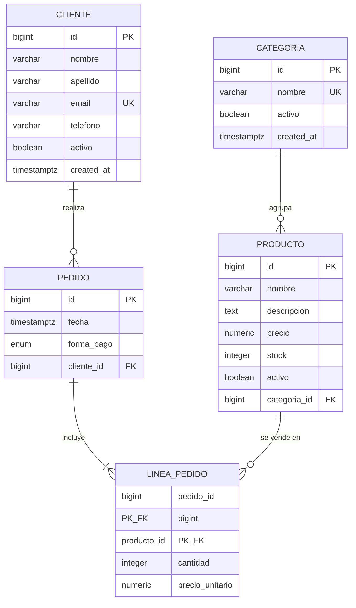

**Materia:** Base de Datos I — Tecnicatura Universitaria en Programación (UTN)
**Motor:** PostgreSQL 17 · **Cliente:** DBeaver
**Integrantes:** Guillot Tiago, Monardez Maximo, Ruiz Matias, Mendez Joaquin, Oviedo Thiago y Chacon Facundo

**Pata de Gallo (Crow's Foot)**, sostenida en todo el diagrama. El diagrama está en `diagrama_er.dbml` (pegarlo en <https://dbdiagram.io> para verlo/exportarlo como imagen o PDF) y también embebido aquí en Mermaid.



Tipos a nivel conceptual: **texto**, **numérico**, **entero**, **fecha/hora**, **booleano**, **enumerado**.

| Atributo | Tipo conceptual | Restricción / observación |
|---|---|---|
| id | numérico | **Clave primaria** |
| nombre | texto | Clave candidata alternativa: único en el sistema |
| activo | booleano | Baja lógica (R7) |
| created_at | fecha/hora | Momento de creación |


| Atributo | Tipo conceptual | Restricción / observación |
|---|---|---|
| id | numérico | **Clave primaria** |
| nombre | texto | Candidata en conjunto con la categoría: único dentro de su categoría |
| descripcion | texto | Opcional (atributo adicional razonable) |
| precio | numérico | ≥ 0 (R5) |
| stock | entero | ≥ 0 (R5) |
| activo | booleano | Baja lógica (R7) |
| categoria_id | numérico | FK → categoria. Participación **total** (R1) |


| Atributo | Tipo conceptual | Restricción / observación |
|---|---|---|
| id | numérico | **Clave primaria** |
| nombre | texto | — |
| apellido | texto | — |
| email | texto | Clave candidata alternativa: único (R6) |
| telefono | texto | Opcional (atributo adicional razonable) |
| activo | booleano | Baja lógica (R7) |


| Atributo | Tipo conceptual | Restricción / observación |
|---|---|---|
| id | numérico | **Clave primaria** |
| fecha | fecha/hora | Con zona horaria |
| forma_pago | enumerado | Dominio cerrado: EFECTIVO / TARJETA / TRANSFERENCIA |
| cliente_id | numérico | FK → cliente. Participación **total** (R2) |


| Atributo | Tipo conceptual | Restricción / observación |
|---|---|---|
| pedido_id | numérico | PK compuesta + FK → pedido |
| producto_id | numérico | PK compuesta + FK → producto |
| cantidad | entero | > 0 (R4) |
| precio_unitario | numérico | Precio congelado al momento de la venta (R4) |


| Relación | Cardinalidad | Participación | Justificación |
|---|---|---|---|
| categoria–producto | 1:N | producto **total**, categoria **parcial** | R1: todo producto pertenece exactamente a una categoría; una categoría puede tener muchos productos o ninguno todavía |
| cliente–pedido | 1:N | pedido **total**, cliente **parcial** | R2: todo pedido pertenece exactamente a un cliente registrado; un cliente puede no haber hecho ningún pedido aún |
| pedido–producto | N:M (vía linea_pedido) | pedido **total** respecto de sus líneas, producto **parcial** | R3/R4: un pedido incluye varios productos; un producto puede no haberse vendido nunca |


**1. ¿Por qué la relación entre producto y pedido no puede resolverse como una relación binaria simple 1:N? ¿Qué información se perdería?**

Porque la relación es N:M en ambos sentidos (R3): un pedido incluye *varios* productos **y** un producto aparece en *muchos* pedidos. Una FK solo resuelve uno de los dos sentidos:

- Si pongo `producto_id` en `pedido`, cada pedido tendría **un único producto**: perdería todas las demás líneas del pedido (el pedido 1 de la planilla tiene Muzzarella **y** Coca).
- Si pongo `pedido_id` en `producto`, cada producto pertenecería a **un único pedido**: la Muzzarella dejaría de poder aparecer en los pedidos 1, 3 y 5.

Además, `cantidad` y `precio_unitario` son atributos **de la línea**, no del pedido ni del producto: con una relación binaria simple no tendrían dónde vivir sin repetir columnas o filas.

**2. ¿Qué entidad tiene participación parcial en la relación con categoría, y cuál total? ¿Qué pasaría si invirtieras esa lectura?**

- **Total:** `producto` — todo producto debe pertenecer exactamente a una categoría (R1).
- **Parcial:** `categoria` — puede existir sin ningún producto asociado (R1 lo dice explícitamente: "una categoría recién creada").

Si invirtiera la lectura, concluiría erróneamente que toda categoría debe tener al menos un producto (no podría crearse una categoría vacía para ir cargándola después) y que un producto podría existir sin categoría (violando R1). En el esquema relacional eso se traduciría mal: `categoria_id` nullable en producto, o una obligación injustificada en el otro sentido.

**3. ¿Alguno de tus atributos podría descomponerse en partes más simples?**

Sí: el nombre completo del cliente. Decidí **separarlo** en `nombre` y `apellido` porque el negocio necesita buscar/ordenar clientes por apellido y personalizar comunicaciones; guardarlo compuesto obligaría a parsear texto en cada consulta. En cambio, el nombre del producto (`"Coca 1.5L"`) lo dejé **atómico y simple**: ninguna regla de negocio necesita sus partes (marca, tamaño), así que separarlo sería sobre-ingeniería. La dirección no se modela porque el enunciado no la exige.


Reglas aplicadas: cada entidad fuerte → tabla propia; 1:N → FK del lado N hacia el lado 1 (sin tabla nueva); N:M → tabla intermedia con las dos FK y sus atributos propios.

```
categoria     (id, nombre, activo, created_at)

producto      (id, nombre, descripcion, precio, stock, activo,
               categoria_id -> categoria, created_at)

cliente       (id, nombre, apellido, email, telefono, activo, created_at)

pedido        (id, fecha, forma_pago, cliente_id -> cliente, created_at)

linea_pedido  (pedido_id -> pedido, producto_id -> producto,
               cantidad, precio_unitario)
```

- `producto.categoria_id`: resolución de la relación 1:N categoria–producto (FK NOT NULL porque la participación de producto es total).
- `pedido.cliente_id`: resolución de la relación 1:N cliente–pedido (FK NOT NULL porque la participación de pedido es total).
- `linea_pedido`: resolución de la N:M pedido–producto, con los atributos propios de la relación (`cantidad`, `precio_unitario`) según R4.

**Elección de la clave primaria de la tabla intermedia:** elegí la **clave compuesta `(pedido_id, producto_id)`**. Justificación: la regla de negocio dice que dentro de un mismo pedido un producto no se repite en más de una línea, entonces esa combinación identifica naturalmente cada línea. Usarla como PK hace cumplir la regla **en el motor**, sin constraints adicionales. Con una clave sustituta (`id` serial) habría que agregar igualmente un `UNIQUE (pedido_id, producto_id)` para prohibir duplicados; es decir, más código para obtener exactamente lo mismo, más un identificador artificial que nadie usa.


**1. ¿Qué pasaría si la tabla intermedia no incluyera ambas claves foráneas como NOT NULL?**

Podrían existir **líneas huérfanas**: filas de venta sin pedido o sin producto. Consecuencias concretas:

- Los totales por pedido darían mal (una línea que no suma a ningún pedido) y los reportes por producto perderían ventas.
- En PostgreSQL una PK compuesta **no protege la unicidad cuando hay NULLs** (NULL ≠ NULL), así que podrían duplicarse líneas nulas sin que el motor se queje.
- La relación N:M dejaría de estar bien definida: la tabla intermedia es el único lugar donde vive la relación, y permitir NULLs equivale a modelar relaciones "hacia nada".

**2. Si el pedido pudiera existir sin ningún producto asociado, ¿cambia la participación definida en la Parte 1?**

Sí. Pasaría de **total a parcial**: ya no sería verdad que "todo pedido incluye al menos un producto", sino que un pedido podría existir con cero líneas (por ejemplo, un carrito iniciado que todavía no cerró). Estructuralmente el esquema relacional no cambia (la FK sigue viviendo en `linea_pedido`), pero se pierde la posibilidad de garantizar por declaración SQL que todo pedido tenga al menos una línea: eso pasaría a requerirse con triggers o lógica de aplicación. El diagrama ER debería reflejar la nueva lectura para no mentir sobre el dominio.


Relación universal (una fila por línea de producto vendida):

```
venta (nro_pedido, fecha, cliente, producto, categoria,
       precio_unitario, cantidad, subtotal, forma_pago)
```


La clave candidata es **`(nro_pedido, producto)`**:

- `nro_pedido` solo **no alcanza**: el pedido 1 tiene dos filas (Muzzarella y Coca).
- `producto` solo **no alcanza**: la Muzzarella aparece en los pedidos 1, 3 y 5.
- La combinación sí alcanza: por regla de negocio, dentro de un mismo pedido un producto no se repite en más de una línea.

Es además la **única** clave candidata: ningún otro subconjunto de atributos identifica filas de forma única.


De los datos y las reglas de negocio:

| FD | Justificación |
|---|---|
| `nro_pedido → fecha, cliente, forma_pago` | Cada pedido tiene una única fecha, un único cliente y una única forma de pago (verificado: ambas filas del pedido 1 repiten Ana Gómez / EFECTIVO / 01-03) |
| `producto → categoria` | Cada producto pertenece a una única categoría (Muzzarella siempre "Pizzas") |
| `(nro_pedido, producto) → cantidad` | La cantidad es de la línea, no del pedido ni del producto |
| `(nro_pedido, producto) → precio_unitario` | **Observación clave:** la Muzzarella vale 1000.00 en el pedido 1 y 1050.00 en el pedido 3. El precio unitario **no** depende solo del producto: depende del producto *en ese pedido* (precio vigente al momento de la venta) |
| `cantidad, precio_unitario → subtotal` | El subtotal es calculable: `cantidad × precio_unitario` (atributo derivado) |


Todos los atributos contienen **un único valor atómico por celda**: una fecha, un número, un texto simple. No hay listas ni grupos repetidos (los productos de un pedido ocupan filas distintas, no una celda con "Muzzarella, Coca"). **Cumple 1FN.**

Nota: `"Ana Gómez"` podría descomponerse en nombre y apellido, pero eso es una decisión de granularidad de atributos, no un problema de atomicidad: sigue habiendo un solo valor por celda. No afecta la 1FN.


La clave es compuesta `(nro_pedido, producto)`. Busco atributos que dependan de **solo una parte** de la clave:

- `fecha`, `cliente`, `forma_pago` dependen solo de `nro_pedido` → **dependencia parcial, viola 2FN**.
- `categoria` depende solo de `producto` → **dependencia parcial, viola 2FN**.
- `cantidad` y `precio_unitario` dependen de la clave completa → OK.

Corrección (proyección):

```
pedido (nro_pedido, fecha, cliente, forma_pago)
linea  (nro_pedido, producto, precio_unitario, cantidad, subtotal)
```

(`categoria` se resuelve en el paso siguiente junto con la 3FN.)


Busco dependencias transitivas (no clave → no clave):

- En `linea`: `(nro_pedido, producto) → producto → categoria`. La categoría depende transitivamente del producto → saco `categoria` a su propia tabla:

  ```
  producto (producto, categoria)
  ```

- En `linea` también: `cantidad, precio_unitario → subtotal`. El subtotal depende de atributos no clave → es un **atributo derivado** y lo elimino de la tabla (se recalcula al vuelo; ver pregunta de integración).

Resultado:

```
pedido  (nro_pedido, fecha, cliente, forma_pago)
producto (producto, categoria)
linea   (nro_pedido, producto, precio_unitario, cantidad)
```

En `pedido` no hay transitivas: `fecha`, `cliente` y `forma_pago` no se determinan entre sí. **Todas las tablas cumplen 3FN.**


Verifico que **todo determinante sea clave candidata**:

| Tabla | Determinantes | ¿Es clave candidata? |
|---|---|---|
| `pedido` | `nro_pedido` | Sí, es la PK |
| `producto` | `producto` | Sí, es la PK |
| `linea` | `(nro_pedido, producto)` | Sí, es la PK |

Punto fino: ¿podría `producto → precio_unitario` y violar BCNF en `linea`? **No**, y los datos lo demuestran: la Muzzarella vale 1000.00 en el pedido 1 y 1050.00 en el pedido 3, así que el producto solo no determina el precio. El único determinante de `linea` es su clave completa.

**Conclusión explícita: las tres tablas están en BCNF** (en este caso 3FN y BCNF coinciden porque no hay determinantes que no sean claves).


```
pedido       (<u>nro_pedido</u>, fecha, cliente, forma_pago)
producto     (<u>producto</u>, categoria)
linea_pedido (<u>nro_pedido, producto</u>, precio_unitario, cantidad)
```


**1. Comparación entre las tablas normalizadas y las derivadas del ER en la Parte 2**

| Tabla de la normalización | Corresponde en mi ER |
|---|---|
| `pedido` | Entidad `pedido` (con `cliente` convertido en FK hacia la entidad cliente) |
| `producto` | Entidades `producto` + `categoria`: la normalización "descubrió" la categoría como tabla propia, que en el ER ya había modelado explícitamente por R1 |
| `linea_pedido` | La tabla intermedia de la relación N:M, idéntica salvo por los identificadores (nombres vs. IDs numéricos) |

Atributos de mi ER que **no aparecían en la planilla**: `email` y `telefono` del cliente, `stock`, `descripcion`, `activo` (baja lógica), los IDs numéricos sustitutos y `created_at`.

Eso muestra la diferencia de origen: **normalizar datos históricos recupera la estructura implícita en lo que alguien anotó**, pero solo ve esos atributos y esas reglas; **modelar desde el enunciado captura el dominio completo**, incluyendo restricciones que los datos viejos no evidencian (unicidad del mail, control de stock, bajas lógicas para preservar historial). Por eso el esquema final del proyecto es la conciliación de ambos caminos: la normalización valida que el ER no tenga errores de diseño, y el ER completa lo que los datos históricos no muestran.

**2. ¿Conviene almacenar `subtotal` o recalcularlo al vuelo? ¿Viola alguna forma normal?**

Conviene **no almacenarlo**: se recalcula como `cantidad × precio_unitario`, que es una multiplicación trivial. Almacenarlo introduce una dependencia funcional entre atributos no clave (`cantidad, precio_unitario → subtotal`) y por tanto **violaría 3FN**, con riesgo real de inconsistencia si algún proceso actualiza cantidad y olvida actualizar subtotal. No es un tradeoff de formas normales contra rendimiento en este caso: si el cálculo fuera costoso existen herramientas específicas (vistas, vistas materializadas). La trazabilidad histórica que motiva guardar cosas ya está cubierta por `precio_unitario` congelado en la línea (R4), así que un subtotal persistido no aporta información nueva, solo redundancia.


| Archivo | Contenido |
|---|---|
| `TP1_FoodStore_Desarrollo.md` | Este documento (Partes 1, 2 y 3 + preguntas guía e integración) |
| `diagrama_er.dbml` | Diagrama ER en notación Crow's Foot (dbdiagram.io) |
| `schema.sql` | DDL definitivo en PostgreSQL (Parte 4), ejecutable sin errores |
| `DUIA.md` | Declaración de Uso de IA |